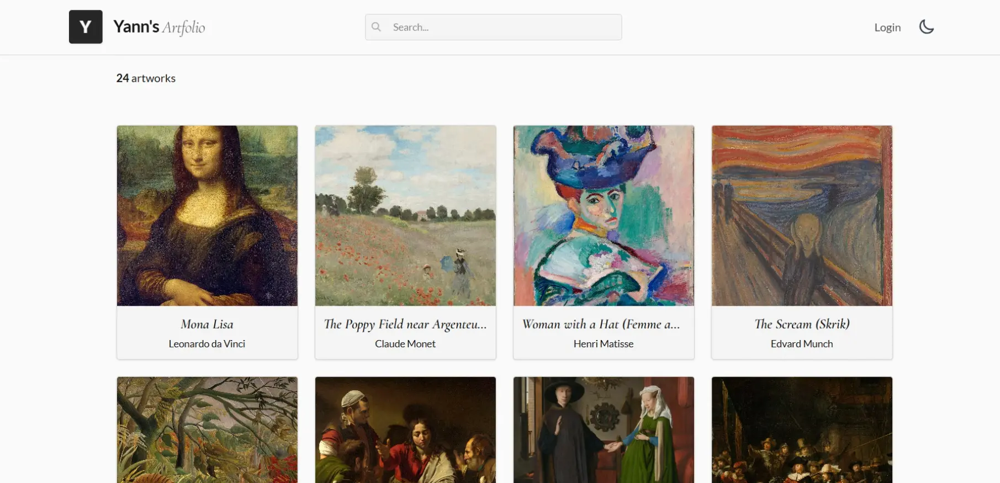

# Artfolio

A fullstack art gallery app
Built with React, Node/Express, and MongoDB.

## Features

- Browse and search artworks by title or artist
- Artwork detail modal with full resolution view
- Admin dashboard — add, update, delete artworks
- JWT authentication with protected routes
- Responsive design with dark mode

## Tech Stack

**Client** — React, Tailwind CSS, Axios  
**Server** — Node.js, Express, MongoDB, Mongoose  
**Auth** — JWT, bcrypt  
**Tests** — Vitest, React Testing Library

## Getting Started

Note: This project is presented in read-only mode. Admin features (CRUD operations) are not accessible in this version.

**Clone the repo**
git clone https://github.com/qquazld/artfolio.git

**Install dependencies**
cd client && npm install
cd server && npm install

**Run the app**

You need to run both client and server in separate terminals :

cd server && npm run start
cd client && npm run dev
